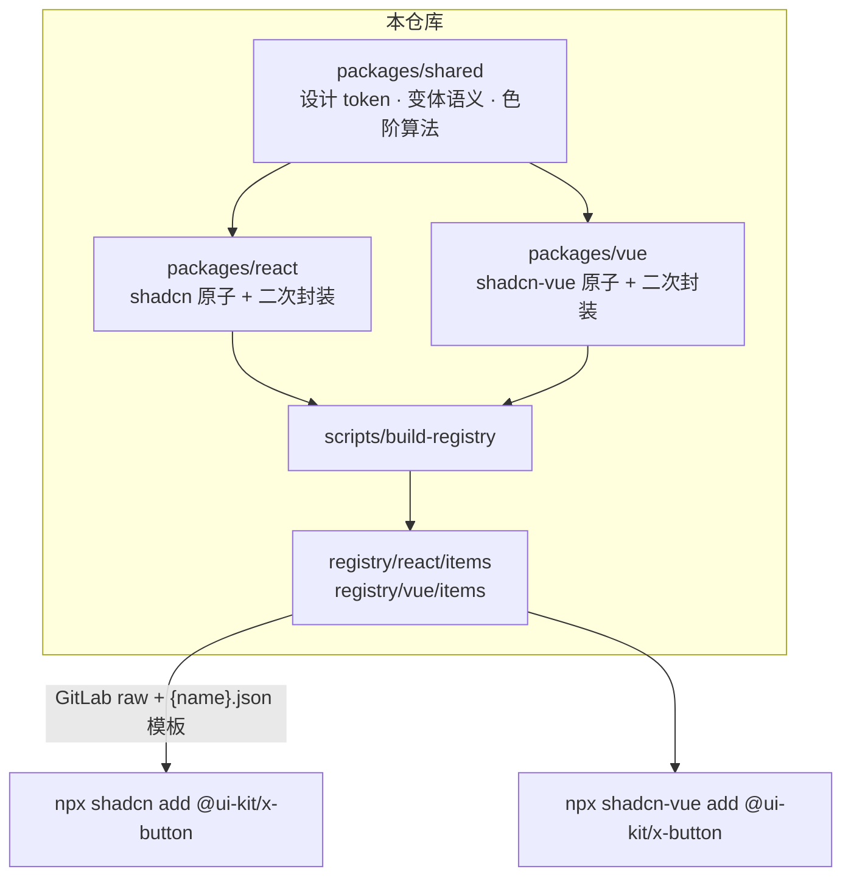

# ui-kit

一套参考 Nuxt UI 规范、基于 shadcn 原子组件二次封装的设计系统，同时支持 **Vue 3** 与 **React**。

- 基础组件（原子层）直接使用 shadcn 官方组件：React 端基于 **Base UI**（base-nova 风格），Vue 端基于 shadcn-vue（reka-ui）
- 二次封装组件（封装层）内置变体语义，通过 **shadcn CLI registry** 分发，不发布 npm
- 样式使用 Tailwind CSS v4，设计 token 由主色 seed 通过 Ant Design 色彩算法自动派生
- 动效使用 Framer Motion 家族（React：motion，Vue：motion-v）
- **hooks 独立拆分**：hook 文件单独分发为 `registry:hook` item（hooks/use-mobile、hooks/use-media-query），组件通过 registryDependencies 引用



## 目录结构

```text
├── packages/
│   ├── shared/            # 设计 token、变体语义、色彩派生算法（框架无关）
│   ├── react/             # React 端：src/components/ui（原子）+ src/components/kit（二次封装）
│   └── vue/               # Vue 端：同样结构，基于 shadcn-vue
├── registry/              # 生成的 registry JSON（提交到仓库，供 CLI 消费）
│   ├── react/registry.json + items/*.json
│   └── vue/registry.json + items/*.json
├── apps/
│   ├── react-demo/        # React 消费端示例（通过 registry 安装组件）
│   ├── vue-demo/          # Vue 消费端示例
│   ├── docs/              # VitePress 文档站（Vue / React 双视角，组件页含动效说明）
│   └── theme-designer/    # 主题设计器：主色 seed 派生色阶 + 组件实时预览 + CSS 变量导出
└── scripts/
    ├── build-registry.ts  # 从 packages 源码生成 registry JSON
    └── serve-registry.mjs # 本地静态服务器（本地验证分发链路）
```

## 分层架构

```text
组件层 Components   统一风格的成品组件：XButton · XBadge · XCard ...
   ▲
封装层 Wrapper     注入设计 token、variant/color/size 预设、Framer Motion 动效
   ▲
原子层 Atoms        React：shadcn Base UI 原子（@base-ui/react）
                    Vue：shadcn-vue 原子（reka-ui）
```

## hooks 拆分约定

hook 一律独立成文件，放在 `packages/react/src/hooks/`，并以 `registry:hook` 类型
单独分发（`npx shadcn add @ui-kit/use-media-query`）。依赖 hook 的组件通过
`registryDependencies` 声明，CLI 添加组件时自动带入 hook 文件，落盘到
消费者项目的 `hooks/` 目录。

## 分发方式（通过 shadcn CLI，不发布 npm）

仓库推送到 GitLab 后，消费者项目先注册本仓库 registry，再添加组件：

**React 项目**

```bash
# 1. 注册 registry（一次性，写入 components.json）
npx shadcn@latest registry add @ui-kit=https://git.newcapec.cn/02-newcapec/ai/UIService/helper/ui-kit/-/raw/main/registry/react/items/{name}.json

# 2. 添加组件（自动拉取 shadcn 原子依赖并安装 npm 依赖）
npx shadcn@latest add @ui-kit/x-button
```

**Vue 项目**

```bash
# 1. 在 components.json 中注册 registry
#    "registries": { "@ui-kit": "https://git.newcapec.cn/02-newcapec/ai/UIService/helper/ui-kit/-/raw/main/registry/vue/items/{name}.json" }

# 2. 添加组件
npx shadcn-vue@latest add @ui-kit/x-button
```

添加时 CLI 会自动：

- 拉取组件源码到 `components/kit/`（依赖的原子组件落到 `components/ui/`，工具函数落到 `lib/`）
- 安装组件声明的 npm 依赖
- 把设计 token 注入项目 CSS（`@theme` 中的语义色色阶、圆角、阴影、字体阶梯）

### 本地验证分发链路

registry JSON 提交前可先用本地服务器验证：

```bash
pnpm serve:registry          # 启动 http://localhost:8123
# 把 demo 项目 components.json 中的 @ui-kit 地址临时改为
# http://localhost:8123/registry/react/items/{name}.json
cd apps/react-demo && npx shadcn@latest add @ui-kit/x-button
```

## 内置变体语义

所有二次封装组件共享同一套变体语义（定义在 `packages/shared/src/variants.ts`）：

| 维度 | 取值 | 默认 |
| --- | --- | --- |
| variant（按钮样式） | solid · outline · soft · ghost · subtle · link | solid |
| size（尺寸） | xs · sm · md · lg · xl | md |
| color（语义色） | primary · secondary · neutral · success · info · warning · error | primary |

```tsx
<XButton variant="soft" color="success" size="lg">保存</XButton>
```

## vben 风格 hook（hook 先行）

有状态与行为的组件全部提供配套 `useXxx` hook，调用即得 `[Component, api]`：
组件挂载后通过 api 控制实例，两种用法（props 受控 / hook api）共存。

```tsx
/* React */
const [Modal, modalApi] = useXModal({ title: '对话框标题', onOk: () => {} })
return <><button onClick={() => modalApi.open()}>打开</button><Modal>正文</Modal></>
```

```ts
/* Vue */
const [Modal, modalApi] = useXModal({ title: '对话框标题' })
modalApi.open()
modalApi.setState({ title: '新标题' })
```

提供 hook 的组件：

```text
浮层：useXModal · useXDrawer · useXSlideover · useXTooltip · useXPopover ·
      useXCommandPalette · useXDropdownMenu · useXContextMenu
表单/数据：useXForm（读写数据/校验/重置/提交）· useXTable（loading/分页/reload）
行为：useXStepper · useXCarousel · useXAccordion · useXCollapsible ·
      useXScrollArea · useXSplitter
```

React 端 hook 基于 `lib/kit/bound-store.ts`（useSyncExternalStore 订阅容器，随组件自动分发），
Vue 端基于 reactive 状态，hook 文件随组件 item 一起落地到 `components/kit/`。

## 设计 token

- **色彩**：shadcn 语义变量 + 色阶派生。主色 seed `#1677ff`，通过 `@ant-design/colors` 生成 10 级色阶（`primary-1` 至 `primary-10`）。hover 取 5 级，active 取 7 级，浅色底取 1 级。
- **字体**：Inter，阶梯 12 / 14 / 16 / 20 / 24 / 30 / 38
- **圆角**：6 / 8 / 12 / 9999（sm / md / lg / pill）
- **阴影**：sm / md / lg（blur 2 / 12 / 24）
- **间距**：4 → 48 七档
- **动效**：fast 120ms ease-out · base 200ms ease-in-out · slow 300ms spring

## 本地开发

```bash
pnpm install
pnpm build:registry   # 修改组件源码后重新生成 registry JSON
pnpm typecheck        # 全部包类型检查
pnpm test             # 全部包单元测试
```

## 文档站

交互式文档站（`apps/docs`）：VitePress + i18n 双版本切换（arco 式 Vue / React 全站切换），demo 双框架原生渲染（lobe-ui 风格 DemoBlock：画布 + 展开代码 + 复制）。

```bash
pnpm -C apps/docs docs:dev     # 本地开发（自动合并两包源码到 vendor）
pnpm -C apps/docs docs:build   # 构建静态站（产物 .vitepress/dist）
```

- Vue demo 由 VitePress 原生渲染，React demo 由页面内容器 `createRoot` 挂载
- `prepare-vendor` 脚本把 packages/react 与 packages/vue 的 src 合并到 `apps/docs/vendor`，alias customResolver 依据导入方路由到对应框架源码
- Vercel 部署配置见 `apps/docs/vercel.json`（framework vitepress，构建 `docs:build`）

组件列表（二次封装层）：

```text
布局 Layout（12）
按钮 XButton · 按钮组 XButtonGroup · 徽标 XBadge · 芯片 XChip · 头像 XAvatar ·
头像组 XAvatarGroup · 卡片 XCard · 容器 XContainer · 图标 XIcon · 键盘按键 XKbd ·
分割线 XSeparator · 骨架屏 XSkeleton

表单 Forms（19）
输入框 XInput · 多行文本 XTextarea · 多选框 XCheckbox · 单选框组 XRadioGroup ·
开关 XSwitch · 选择菜单 XSelectMenu · 输入菜单 XInputMenu · 滑块 XSlider ·
数字输入 XInputNumber · 标签输入 XInputTags · 日期选择 XInputDate · 时间选择 XInputTime ·
评分 XInputRating · 颜色选择 XColorPicker · 验证码输入 XPinInput · 文件上传 XFileUpload ·
表单 XForm · 表单字段 XFormField · 字段组 XFieldGroup

导航 Navigation（7）
链接 XLink · 面包屑 XBreadcrumb · 标签页 XTabs · 导航菜单 XNavigationMenu ·
分页 XPagination · 步骤条 XStepper · 命令面板 XCommandPalette

浮层 Overlays（8）
对话框 XModal · 抽屉 XDrawer · 侧滑 XSlideover · 文字提示 XTooltip · 气泡 XPopover ·
右键菜单 XContextMenu · 下拉菜单 XDropdownMenu · 消息通知 XToast

内容 Content（9）
表格 XTable · 警告提示 XAlert · 进度条 XProgress · 手风琴 XAccordion · 折叠 XCollapsible ·
列表 XListbox · 滚动区域 XScrollArea · 轮播 XCarousel · 分割面板 XSplitter
```
